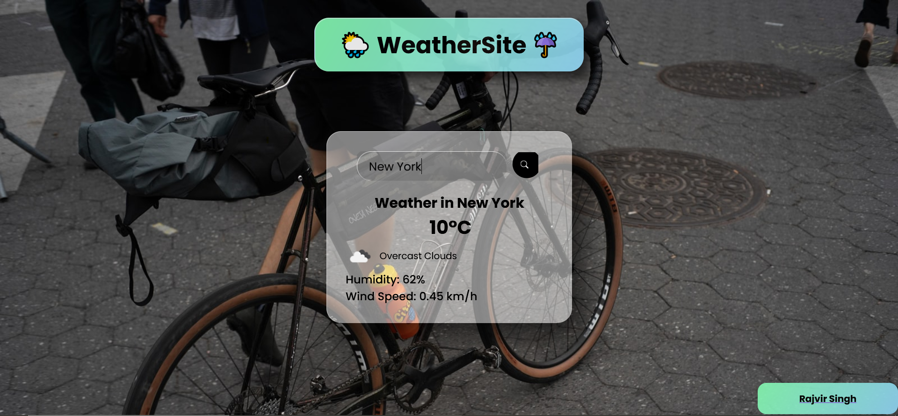

# WeatherSite
This is a weather application which can tell you the weather of any location with a spice of new  updated background image, glassmorphism effect and tilt effect.

## Technologies Used

* HTML
* CSS
* JavaScript
* OpenWeatherMap API
* Unsplash API

## How It Works

1. All you need to do is to type the location of any city/place in the search box and press the enter or click the search button. 
2. Then the results will be updated consisting of temperture,weather condition, wind speed, Humidity.
3. All of this information if fetched using the [OpenWeatherMap API](https://openweathermap.org/api). 
4. On every new search, background image is updated and is fetched from [Unsplash API](https://unsplash.com/developers).

## Screenshots

Desktop Website

  

  

Mobile website(Responsive)

  

 

